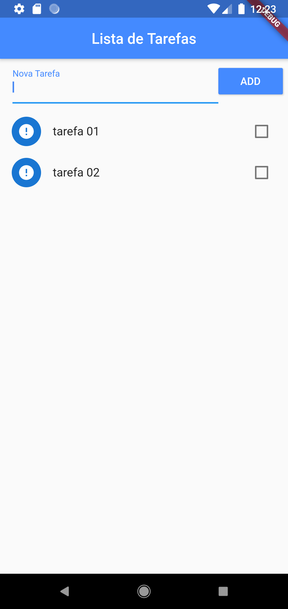
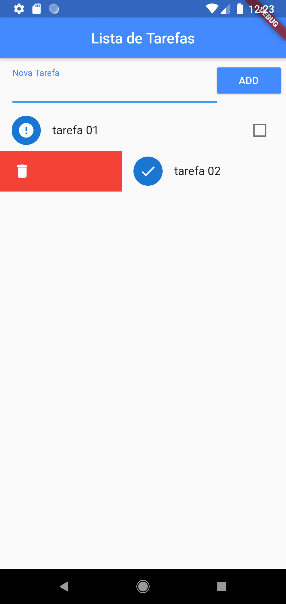
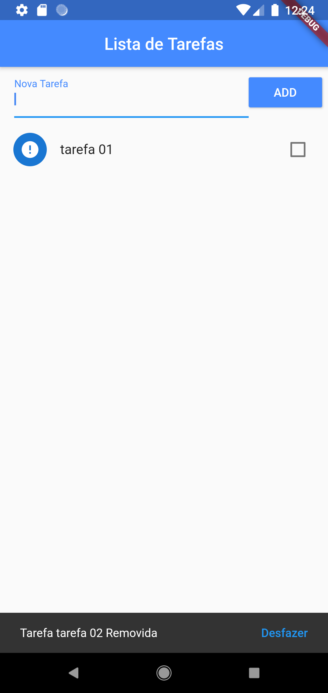

# Lista de tarefas!

Olá, este é um projeto de uma lista de tarefas em flutter. Neste app você tem a possibilidade de adicionar tarefas, marca-las como concluida e excluir elas.

Para este projeto foi utilizado  [path_provider)](https://pub.dev/packages/path_provider) para guardar e recuperar as tarefas localmente no celular, com um arquivo json.

## Screenshots

<table>
  <tr>
    <td></td>
    <td></td>
  </tr>
  <tr>
	<td></td>
	<td></td>
  </tr>
</table>